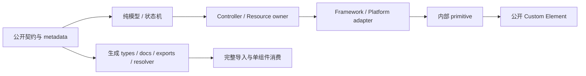

<!-- cspell:words nodeNext treegrid overscan axe-core FormData ElementInternals AbortSignal WeakMap NodeNext codemod -->

# ElfUI Kit 下一代对标与架构收敛总计划

> 状态：Active / 唯一计划事实源
> 建立日期：2026-08-08（Asia/Shanghai）
> 更新日期：2026-08-11（Asia/Shanghai）
> 当前基线：`@elfui/kit@0.0.2-beta.6`、ElfUI Core/Compiler/Vite Plugin `0.1.0-beta.21`
> 对标快照：Element Plus `2.14.4`、Vuetify `4.1.8`（均以 2026-08-07 官方 release 为准）

本文件取代仓库中此前 11 份日期计划和 133 份组件/页面级 `plan.md`；其中 192 个未完成勾选项已归并到下方批次。旧文件不再保留在工作树；需要追溯历史时使用 Git。今后不得再建立第二份平行总计划，也不得在组件目录重新维护完成度清单。

## 1. 最终目标

ElfUI Kit 的下一代版本必须同时达到以下结果：

1. 对齐 Element Plus 的高频公开契约与交互语义，包括 props、默认值、events、slots、exposes、受控优先级、表单、键盘和 ARIA；不机械复制 Vue 实现。
2. 对齐 Vuetify 的跨组件系统能力，包括 Defaults、Theme、Locale、Icons、Display、Platform、Application Layout、Date、GoTo、Overlay、Aliases、Blueprint/Presets、Tokens 和 SSR/Hydration。
3. 保持 ElfUI 的 Custom Elements、Shadow DOM、Provider、Teleport 和宏编译优势；框架已有能力必须优先使用。
4. 所有组件、类型和 Kit 公共 API 只从 `@elfui/kit` 根入口命名导入；同时支持手动按需注册、`registerAllComponents()` 全量注册、真实 tree-shaking 和稳定类型提示。
5. 用户能够通过语义 token、组件 CSS 自定义属性和 `::part()` 完成稳定样式覆盖，不依赖 Shadow DOM 内部结构。
6. 所有公开能力都有模型测试、组件测试、真实消费者测试和适用的浏览器证据；测试绿色不能靠跳过、放宽断言或任意等待。
7. 达到可发布 `1.0` 的稳定性：没有未解释循环依赖、外部输入原地修改、资源泄漏、异步陈旧写回和未声明破坏性差异。

“对标”不等于组件名称一一复制。对于上游的每项能力，ElfUI 必须明确记录为：`equivalent`、`combined`、`implement` 或 `non-goal`，并给出源码、测试和文档证据。只有带证据的 `equivalent/combined/implement` 才计入完成。

## 2. 官方事实源

- Element Plus release：<https://github.com/element-plus/element-plus/releases/tag/2.14.4>
- Element Plus 组件总览：<https://element-plus.org/en-US/component/overview.html>
- Element Plus 完整/按需导入：<https://element-plus.org/en-US/guide/quickstart.html>
- Element Plus Config Provider：<https://element-plus.org/en-US/component/config-provider.html>
- Vuetify release：<https://github.com/vuetifyjs/vuetify/releases/tag/v4.1.8>
- Vuetify 官方仓库与系统实现：<https://github.com/vuetifyjs/vuetify>
- ElfUI 框架契约：相邻 `elfui-docs` 仓库的当前中英文文档和实际安装类型。

每次开始新的对标批次时重新确认上游最新稳定版；升级对标快照必须单独提交矩阵差异，不得顺手扩大正在执行的组件范围。

## 3. 当前事实基线

### 3.1 已有优势

- Kit 全量测试当前为 161 个文件、1555 项通过；宏类型检查扫描 519 个源码文件和 141 个宏组件，0 错误。
- Website 全量测试当前为 117 个文件、412 项通过；宏类型检查扫描 724 个源码文件和 582 个宏组件，0 错误。
- `@elfui/kit` 已收敛为 side-effect-free 单根入口；显式全量注册、组件自带默认样式、可选 utilities 安装和 Button/Input consumer tree-shaking 已有自动门禁。
- Overlay stack/lifecycle、focus scope、date adapter、virtual window、Provider defaults 已有可复用基础。
- 双语文档严格审计当前为 567/567。
- TableV2、TreeSelect、DateTimePicker、TimeSelect、MessageBox、主题与服务默认值等功能已落地。

### 3.2 已确认阻塞项

- 稳定 Form 控件未接入 `defineOptions({ formControl: true })` / `useFormControlContext()`，原生 `FormData`、reset、disabled fieldset 和状态恢复没有完整契约。
- Tree、Cascader、Upload 存在修改用户输入对象或数组的路径。
- Upload 存在 data/beforeUpload rejection、同步完成 request handle、chunk abort 和陈旧异步写回风险。
- Table 选择同时维护响应式状态和手工 DOM 状态；快速虚拟路径监听器密度高。
- Input/Textarea/Switch 手工覆写 host 原生方法，没有使用 `defineExpose(..., { overrideNative })`。
- Metadata、类型、根导出、注册 manifest 与文档表格仍未由同一生成器产出，存在后续漂移风险。
- Website 为保证全部文档示例可用，当前启动时调用 `registerAllComponents()`；生产主 chunk 约 2.85 MB raw、612 KB gzip，需改为路由级显式注册并建立首屏预算。
- Tarball 的 Vite、TypeScript NodeNext、纯浏览器 ESM、SSR 与 CDN consumer matrix 尚未闭合；当前只有 Rollup Button/Input 按需门禁。
- 113 个带样式的稳定组件中有 45 个没有公开 `part`；复杂组件的组件级 CSS 变量和 Style API 文档不完整。
- Form/FormItem 和 Table 模型存在类型或模块环；低层 `composables/form.ts` 反向依赖组件层类型。
- Style API metadata、稳定 parts、组件 token 和覆盖示例仍未达到全组件 100%。

## 4. 目标架构

依赖只能从右侧公开组件向左侧稳定能力流动，低层不得导入公开组件实现。共享契约类型放在定义语义的最低层。类型环和运行时环都视为架构失败。

采用模式的边界：

- Strategy：日期、图标、locale、排序、筛选、格式化等真实可替换算法。
- Adapter：浏览器、框架、请求、外部 i18n、流媒体等边界翻译。
- State Machine：Upload task、Cascader lazy transaction、Picker range、Overlay lifecycle 等有明确状态转换的领域。
- Controller：持有监听器、observer、timer、AbortController、object URL、焦点或滚动资源的对象。
- Facade：ConfigProvider 和应用级创建 API，只聚合稳定服务，不复制具体实现。
- Registry：仅用于 overlay stack、layout items 等确实需要跨实例协调的资源，并且必须 Provider/application scoped。

禁止万能 composable、进程级可变单例、仅为减少行数建立的共享 DOM 外壳，以及通过 timeout/手工 DOM 修补框架时序。

## 5. 执行与勾选规则

1. 批次严格从上到下执行；前一批次退出门禁未通过，后一批次不得宣布完成。
2. 同一批次可拆原子提交，但每个提交必须保持公开契约、实现、类型、样式、测试和文档同步。
3. `[x]` 只表示完整达到该项验收标准；“已写文档”“局部测试通过”或“已有代码”不能单独勾选。
4. 命令结果、bundle 数据、截图和浏览器结论写入 `docs/reports` 或 `docs/baselines`，本文件只链接证据，不复制流水账。
5. 新发现的缺口加入对应批次，不新建日期计划或组件 `plan.md`。
6. 上游框架缺口必须进入 `docs/framework-issues` 的最小复现；Kit 中的临时 workaround 必须带移除条件和回归测试。
7. 所有性能数字使用固定环境五次中位数；超过当前确认基线 10% 的退化必须解释或回退。

## 6. 批次总览

| 顺序 | 优先级 | 批次                                               | 结果                     |     状态     |
| ---: | :----: | -------------------------------------------------- | ------------------------ | :----------: |
|    0 |   P0   | 计划、事实基线与发布门禁                           | 建立可信执行系统         |    Ready     |
|    1 |   P0   | 平台正确性：Form、不可变输入、框架 API、异步止血   | 消除数据与浏览器语义风险 | Blocked by 0 |
|    2 |   P0   | Metadata、单组件入口、resolver 与真实 tree-shaking | 解决发布消费架构         | Blocked by 1 |
|    3 |   P1   | 共享能力与分层收敛                                 | 为大型组件提供唯一 owner | Blocked by 2 |
|    4 |   P1   | Element Plus 组件契约与大型组件重构                | 完成组件级对标           | Blocked by 3 |
|    5 |   P1   | Vuetify 跨组件系统能力                             | 完成框架级对标           | Blocked by 4 |
|    6 |   P1   | Style API、Tokens、Parts 与视觉系统                | 完成用户可定制性         | Blocked by 5 |
|    7 |   P2   | 性能、无障碍、SSR 与浏览器矩阵                     | 建立可发布证据           | Blocked by 6 |
|    8 |   P2   | 文档、迁移、生态消费与 1.0 发布                    | 交付稳定版本             | Blocked by 7 |
|    9 |   P3   | Labs 与可选扩展                                    | 不阻塞稳定核心           | Blocked by 8 |

## Batch 0 — P0 计划、事实基线与发布门禁

目标：先让“完成”可信，避免测试或计划继续提供假绿色。

- [x] **NG-000 旧计划收敛。** 删除 144 份日期与组件/page 旧计划，归并其中 192 个未完成项，建立本文件为唯一事实源；Git 保留历史。
- [x] **NG-001 锁定对标矩阵。** 以 Element Plus 2.14.4 和 Vuetify 4.1.8 建立机器可读 capability/contract matrix；每项包含上游链接、ElfUI owner、状态、差异、测试和文档入口。
- [ ] **NG-002 重新生成仓库基线。** 记录源码/宏组件/测试数量、bundle、公开 entries、Style API、依赖图、10k 数据性能、listener/observer/timer 和浏览器矩阵，不复制旧计划中的历史数字。
- [ ] **NG-003 修复能力清单门禁。** 删除 `toHaveLength(119)` 等硬编码计数，由源码扫描生成期望集合；缺失 owner 时输出具体文件。
- [ ] **NG-004 建立全图循环依赖门禁。** 扫描全部非测试 TS，包括 type-only import；禁止跨层反向依赖和 SCC，先消除 Form/FormItem、Table 模型环。
- [ ] **NG-005 建立唯一 release gate。** 新增 `pnpm release:check`，至少串行包含 format ratchet、ESLint、CSpell、全量 typecheck、全量 tests、strict locale audit、website build、library build、tarball consumer、SSR 和 architecture tests。
- [ ] **NG-006 收紧 prepublish。** `prepublishOnly` 和 release workflow 只调用 `release:check`；任何一步失败不得发布或通过“只跑 Kit 测试”绕过。
- [ ] **NG-007 测试纪律。** 记录并消除 skipped/flaky/任意等待；大入口冷加载超时通过拆分注册入口和测试 setup 解决，不提高全局 timeout 掩盖。

退出门禁：`pnpm test` 包含全部 7 类架构/契约脚本并全绿；依赖图 0 环；`release:check` 可从干净 checkout 重复执行且失败能阻止发布。

## Batch 1 — P0 平台正确性与关键止血

目标：消除会破坏用户数据、原生表单和异步生命周期的基础错误。

### 1A. 原生 Form Associated Custom Elements

- [ ] **NG-100 下沉 Form 契约。** 将 rule、trigger、context、field size 等共享类型移到 `types`/domain 层，`composables` 不再导入 Form/FormItem 组件层。
- [ ] **NG-101 组合双层表单协议。** Kit Form/FormItem 继续负责规则、字段、消息和布局；Core `useFormControlContext()` 唯一负责 ElementInternals、native form value、validity、reset、disabled 和 restore，不建立第二套注册表。
- [ ] **NG-102 接入全部适用控件。** Input、Textarea、InputNumber、Checkbox/Group、Radio/Group、Switch、Select、Cascader、TreeSelect、Autocomplete、Mention、InputTag、InputOtp、Slider、Rate、ColorPicker、Date/Time 系列和 Upload 明确声明是否 form-associated；适用者使用 `defineOptions({ formControl: true })`。
- [ ] **NG-103 序列化协议。** 定义 string/number/boolean/array/date/file 的 `setFormValue` 规则、空值、`name`、`form`、multiple 和受控值优先级；破坏性差异写迁移说明。
- [ ] **NG-104 原生表单测试矩阵。** 覆盖 `new FormData(form)`、native submit/reset、required/custom validity、外部 `form` 关联、disabled fieldset、state restore、受控/非受控、Shadow DOM 和 standalone。

### 1B. 外部输入不可变

- [ ] **NG-110 建立冻结输入门禁。** 对 data/options/fileList/modelValue 等对象输入使用 `Object.freeze`/deep-freeze 契约测试，组件不得抛错或写入用户对象。
- [ ] **NG-111 Tree 内部 Store。** lazy children、append/remove/insert/update/setData 只修改内部规范化 store；受控数据通过事件/model 通知父级，禁止 `props.data.push/splice` 和写 `row.raw.children`。
- [ ] **NG-112 Cascader 私有 lazy 状态。** 使用 keyed store/WeakMap 保存 loading/resolved/children；加入 options epoch 和 unmount token，旧 callback 不得写入新实例或新 options。
- [ ] **NG-113 Upload owned snapshot。** controlled fileList 复制为内部 task snapshot，所有更新生成新 item；用户对象和原始 File 只读。

### 1C. 框架 API 采用与异步止血

- [ ] **NG-120 原生方法暴露。** Input/Textarea/Switch 迁移到 `defineExpose(..., { overrideNative })`；删除手工 `Object.defineProperty` 和卸载 delete。
- [ ] **NG-121 生命周期资源审计。** 稳定事件使用 `useEventListener/useClickOutside/useEscapeKey`，Observer 使用 Core helper；动态语义 adapter 可保留 controller，但资源获取与释放必须同 owner。
- [ ] **NG-122 消除重复 slot observer。** 已有 `slotchange` 足以覆盖的组件删除 MutationObserver；保留者写明无法由 slotchange 表达的语义并测试。
- [ ] **NG-123 Upload 立即止血。** 捕获 beforeUpload/data/request rejection；同步 success/error 后不得重新登记 request handle；chunk upload 接入 AbortSignal/epoch；abort 后不得回写 progress/success。
- [ ] **NG-124 异步通用规则。** 所有 lazy/remote/upload/validation 路径具有 request id、取消、最后写入规则、unmount cleanup 和 rejection 测试。

退出门禁：适用表单控件原生矩阵全绿；冻结输入测试全绿；非测试源码无手工 host `focus/blur` 覆写；Upload/Cascader/Tree 的 abort、换 props、卸载和 rejection 不产生陈旧写回或未处理 Promise。

## Batch 2 — P0 Metadata、单根入口与真实按需导入

目标：让发布包只有一个可预测的 JS/TS 公共入口，通过命名导出和显式注册同时满足按需与全量消费。

### 2A. Metadata 单一数据源

- [ ] **NG-200 定义 metadata schema。** 至少包含 component name、tag、category、stability、dependencies、props/defaults、emits、slots、exposes、form association、host attrs、parts、CSS properties、side effects 和 docs route。
- [ ] **NG-201 从宏声明生成。** 从 defineProps/Emits/Slots/Expose/Options 生成规范化 metadata；禁止手写第二份 props 表或注册列表。
- [ ] **NG-202 生成公共产物。** 由 metadata 生成 HTMLElement types、`elements.generated.d.ts`、API JSON、category exports、registration manifest、ConfigProvider defaults 类型、Style API 表和文档 props rows。
- [ ] **NG-203 漂移门禁。** 生成过程稳定、排序确定；CI 执行后 `git diff --exit-code`，任何源码/类型/文档/exports 漂移直接失败。

### 2B. 包入口设计

- [x] **NG-210 唯一根入口。** `package.json#exports` 只公开 `.`；Basic、Data、Form、Feedback、Layout、Navigation、Picker、Providers、AI 与 Labs 的构造器和类型全部从 `@elfui/kit` 命名导出，禁止 `/labs`、`/utils`、`/components/*` 和 CSS subpath。
- [x] **NG-211 显式注册。** 根入口必须 side-effect-free，不得因 `import { Button } from "@elfui/kit"` 自动注册任何标签；按需注册直接使用 `@elfui/core` 的 `registerComponents()`/`useComponents()`，Kit 不重复包装或重导出框架 API。
- [x] **NG-212 全量注册。** 根入口导出幂等的 `registerAllComponents()`，只有调用时才注册稳定、AI 与 Labs 全集；同标签同构造器重复调用成功，不同构造器保持 Core 冲突诊断。
- [ ] **NG-213 组件派生与命名。** 用户通过 Core `useVariant()`/`useExtend()` 派生新构造器和真实自定义标签；普通外观继续使用组件 `variant` prop，Kit 不建立第二套 aliases/rename registry。
- [x] **NG-214 样式副作用。** 组件结构样式只通过 `defineStyle()` 随组件进入 Shadow DOM，不发布或要求额外 CSS；可选工具类只通过根入口的 `installUtilityStyles(target?)` 显式安装且可释放，不得随 import 自动注入；并以 `var(--component-token, var(--semantic-token, fallback))` 保证无全局样式也有默认外观。
- [ ] **NG-215 主题覆盖契约。** 复用 Core `theme()` 做按 tag 的 CSS Variables/`::part()` 注入，ConfigProvider/ThemeProvider 负责可嵌套上下文；每个组件公开并记录稳定 tokens、parts 和 fallback，禁止依赖私有 `--_*` 变量。
- [ ] **NG-216 公共导出一致性。** 全类别由生成器统一导出和生成注册 manifest；消除“已注册但根类型/构造器缺失”以及 Website 源码深路径 alias。

### 2C. 真实消费者门禁

- [ ] **NG-220 Tarball matrix。** 对 `pnpm pack` 产物建立 Vite、Rollup、TypeScript NodeNext、纯浏览器 ESM 四类 fixture，禁止直接 alias 到 `packages/kit/src`。
- [x] **NG-221 Tree-shaking 断言。** 从根入口只导入 Button/Input 的消费产物不得包含 Table、Picker、AI、Labs 或注册任何未请求标签；调用 `registerAllComponents()` 时才允许进入全量组件和样式。
- [ ] **NG-222 Bundle budgets。** 固定 external/core 口径，记录 full、单组件、典型表单、典型后台页；任一五次中位数 gzip 增长超过 10% 必须阻断并调查。
- [ ] **NG-223 Package verifier。** 校验 exports 可解析、声明路径存在、sideEffects 正确、无源码别名/本地绝对路径、CDN 可用、重复注册有明确诊断。
- [ ] **NG-224 Website 路由级注册。** 文档站不得在首屏同步调用全量注册；由路由 metadata 声明组件依赖并在页面 chunk 内注册，AI/Labs/稳定组件均可直达显示，首屏主 chunk gzip 建立预算且不得因新增组件线性增长。

退出门禁：发布 tarball 只暴露根入口并同时通过命名按需、显式全量注册和 SSR 导入；单组件消费者 0 个无关注册；Website 无 `@elfui/kit-src` 或 Kit subpath，并至少有一套测试使用打包产物而非源码 alias。

## Batch 3 — P1 共享能力与分层收敛

目标：在重构大型组件前建立唯一能力 owner，防止再次复制实现。

- [ ] **NG-300 Overlay 最终协议。** 统一 z-index、appendTo/teleport container、fixed/non-body、嵌套缩放、Visual Viewport/iOS keyboard、nested close cascade、focus return、inert 和 Top Layer；Dialog、Drawer、Menu、Dropdown、Tooltip、PopConfirm、Picker 共用 owner。
- [ ] **NG-301 Collection 协议。** 定义 key、field mapping、selection、expansion、disabled、roving focus 和 typeahead 的无 UI 纯模型；Tree/Select/Menu/Tabs 只复用契约一致部分。
- [ ] **NG-302 Virtual Window 协议。** 统一 fixed/variable size、resize、prepend/append、scrollTo、overscan、anchor preservation 和 bounded DOM；Table、TableV2、Tree、Select、VirtualList 使用同一算法层。
- [ ] **NG-303 Async Task 协议。** 建立 request id、AbortSignal、state transition、retry、progress、resource disposal 的最小无 UI 协议；Upload、remote Select、Cascader lazy 通过领域 adapter 使用。
- [ ] **NG-304 Field surface。** 统一 label、outline/fill、prefix/suffix、clear、density、disabled/readonly/error、focus ring、form reflection；不建立共享 DOM 巨型组件。
- [ ] **NG-305 Directives。** 统一 Draggable、Loading、Infinite Scroll、Click Outside、Observer、Ripple、Tooltip、Touch、Scroll 的 owner、导出、类型和文档，禁止组件手写同义底层监听。
- [ ] **NG-306 Transition/TransitionGroup。** 结构性 enter/leave、快速切换、reduced motion、leave cleanup 和 keyed movement 使用框架能力；Popover Top Layer 时序先最小复现，不写 timeout workaround。
- [ ] **NG-307 服务作用域。** Message/Notification/Loading/MessageBox 等 imperative service 获取创建点的 Config/Theme/Locale/Defaults 上下文；多应用互不污染，资源随 app 销毁。
- [ ] **NG-308 分层门禁。** public component 只能依赖 contract/model/controller/adapter；Common 不得导入具体公开组件，Provider policy 不持有 DOM/XHR/timer。

退出门禁：每项共享能力有唯一 owner、focused tests 和消费者清单；全库无同义底层副本；新增需求可通过配置/Strategy 扩展而非修改所有消费者。

## Batch 4 — P1 Element Plus 组件契约与大型组件重构

目标：完成组件级公开契约对标，同时把复杂组件从“单文件功能集合”改为高内聚领域模块。

### 4A. 全组件契约矩阵

- [ ] **NG-400 覆盖全部上游组件。** Element Plus 2.14.4 总览中的每个组件都有映射；Affix/Sticky、Popover/Tooltip、SelectV2/virtual Select、TreeV2/virtual Tree、panel 类组件等必须明确 equivalent/combined/implement/non-goal。
- [ ] **NG-401 契约字段。** 每个稳定组件比较 props/defaults、events detail、slots、exposes、controlled priority、empty/valueOnClear、form、keyboard、ARIA、loading/empty/error 和 breaking differences。
- [ ] **NG-402 高频 API 优先。** 先闭合用户迁移会直接遇到的命名、默认值、事件 payload 和暴露方法；低价值外观别名不得污染核心模型。
- [ ] **NG-403 Scoped slot 边界。** Transfer、Tree、Segmented、Calendar 建立当前 Compiler 最小复现；支持则交付可运行 slot，不支持则保持未公开并链接框架 issue。

### 4B. Upload

- [ ] **NG-410 Task State Machine。** 明确 validating/ready/uploading/success/error/aborted/retrying 状态和合法转换；状态只由 task owner 写入。
- [ ] **NG-411 Request Adapter。** XHR/custom/chunk 共用 AbortSignal、headers/data、progress、response/error normalization；同步 callback、Promise、abort handle 均只完成一次。
- [ ] **NG-412 资源与并发。** 覆盖并发上限、retry、remove/clear/unmount、object URL、目录、分片、错误恢复和受控 fileList；列表动画不得延迟取消或释放。

### 4C. Tree / Cascader / Select / TreeSelect

- [ ] **NG-420 Tree Store。** 分离 collection、展开、级联选择、lazy transaction、virtual flatten、filter 和 drag transaction；所有公开命令作用于 store。
- [ ] **NG-421 Cascader Index。** 建立 value/path/parent/leaf 索引和一次性 display projection，消除模板中重复全树扫描；lazy、搜索、多选传播和 columns/tree view 分层。
- [ ] **NG-422 Select Collection。** 统一本地/remote/virtual、label cache、options 变化、multiple selection、end-reached 和 overlay adapter；Autocomplete/TreeSelect 组合公开协议，不复制选择模型。
- [ ] **NG-423 10k 数据验收。** Tree/Cascader/Select 的 DOM 保持有界，键盘、筛选、展开、选择、异步替换和返回焦点均通过。

### 4D. Table / TableV2 / VirtualList

- [ ] **NG-430 单一选择状态。** 删除手工 DOM optimistic selection 与 rAF/setTimeout 双状态；用 transaction/model 保证一次提交和可测渲染。
- [ ] **NG-431 模型拆分。** column、row、sort/filter、selection、tree projection、fixed regions、summary、overlay 和 virtual window 独立且无环。
- [ ] **NG-432 热路径治理。** 使用 event delegation 或可回收 row/cell pool；滚动热路径不创建全量 Map、成百上千闭包或不受控 observer。
- [ ] **NG-433 契约补齐。** 核对 column-sort、expanded-rows-change、end-reached、rows-rendered、row-expand、half-selection、ARIA sort/selection 和移动端表头语义。
- [ ] **NG-434 能力边界。** Table 与 TableV2 共享纯模型/虚拟协议，不通过复制代码保持两个版本；动态高度、fixed data、footer/overlay slots 有明确支持矩阵。

### 4E. Picker / Tabs / Menu / Dropdown

- [ ] **NG-440 Picker 分层。** DatePicker/TimePicker 分离 parse/format、date/time model、range state、panel projection 和 overlay；Calendar/DateTimePicker/TimeSelect 共用 DateAdapter。
- [ ] **NG-441 Picker 结构动效。** 正确协调 Transition 与 native Popover；rapid toggle、leave、focus restore、reduced motion、disabled dates 和 SSR 全覆盖。
- [ ] **NG-442 Tabs。** 分离 collection、controlled active value、roving tabindex、overflow、drag transaction 和 panel lifecycle；不建立手写 KeepAlive。
- [ ] **NG-443 Menu/Dropdown。** 缩小 DOM 协调层，保留各自 role、nested close、typeahead、roving focus 和 command payload，复用 Overlay/Collection。

退出门禁：Element Plus capability matrix 无 `unknown`；所有 `implement` 项有源码和测试，所有 `non-goal` 有 Web Component/产品理由；Table/Cascader/Tree/Upload 主文件只做组合和视图协调，不再拥有全部领域状态。

## Batch 5 — P1 Vuetify 跨组件系统能力

目标：完成组件之上的应用框架能力，而不是继续增加孤立组件。

- [ ] **NG-500 Application Layout。** 建立 Provider-scoped layout registry；AppBar、BottomNavigation、Header/Footer/Aside 等注册 edge、order、size、active、overlap，Main 消费稳定 inset CSS vars；支持动态挂卸、多个 layout scope 和 SSR 初始值。
- [ ] **NG-501 Display。** 统一 breakpoint、name、mobile、width/height、platform flags 和响应式订阅；只在安全 lifecycle 访问 matchMedia/window。
- [ ] **NG-502 Platform/SSR/Hydration。** ConfigProvider 接受服务端 platform/display 初始快照；客户端接管不闪跳、不 hydration mismatch；无 DOM 环境可导入和渲染。
- [ ] **NG-503 Defaults。** app/category/component/instance defaults 的合并、优先级、reset 和 Teleport 继承可预测；service-created components 消费相同 defaults。
- [ ] **NG-504 Theme。** 主题 registry、light/dark、局部 scope、color-scheme、动态切换、服务组件、SSR CSS 和品牌扩展边界统一。
- [ ] **NG-505 Presets/Blueprints。** Material 与 Midnight 成为类型安全 preset；允许品牌 preset 组合 tokens/defaults/icons/density，不复制组件实现。
- [ ] **NG-506 Aliases。** 基于 metadata/resolver 的 application-scoped typed aliases；定义 defaults/props merge 和冲突优先级，不做字符串 tag 替换。
- [ ] **NG-507 Locale/i18n adapter。** 稳定 key、fallback、RTL、number/date adapter 和外部 i18n 接口；组件和 imperative services 无 Provider 时仍有一致默认文案。
- [ ] **NG-508 Icons/Date/GoTo。** 明确 Strategy API、应用 scope、SSR 和用户扩展；Tour/DocsToc 等滚动消费者使用统一 GoTo 取消和焦点协议。
- [ ] **NG-509 Overlay service。** overlay stack、z-index、contained/global、scroll strategy、location strategy 和 activator ownership 形成公开稳定边界。
- [ ] **NG-510 ConfigProvider Facade。** 聚合 namespace/tagPrefix、size/density、zIndex、emptyValues/valueOnClear、table/button/link/dialog/message 等 typed config；具体资源仍由各 owner 管理。

退出门禁：Vuetify capability matrix 的 15 类能力全部有唯一 owner 或明确 non-goal；两个 ElfUI app 同页运行时 theme/defaults/layout/aliases/services 相互隔离；SSR 首屏与 hydration 0 warning。

## Batch 6 — P1 Style API、Tokens、Parts 与视觉系统

目标：在 Shadow DOM 隔离下给用户足够、稳定、可文档化的定制面。

- [ ] **NG-600 Token 分层。** 建立 primitive → semantic → component token 三层；组件不得直接硬编码跨主题颜色、elevation、shape、density 和 motion。
- [ ] **NG-601 命名与稳定性。** 公共组件变量统一 `--elf-<component>-*`，内部变量使用 `--_`；定义 deprecated/rename 流程和默认 fallback。
- [ ] **NG-602 Parts 基线。** 所有交互复杂组件至少审计 root/trigger/content或panel/item/empty/loading/header/footer；没有 part 必须说明无需内部定制的理由。
- [ ] **NG-603 优先补齐复杂组件。** Dialog、Drawer、Tour、DatePicker、TimePicker、Tabs、Menu、Tree、Transfer、Carousel、Progress 等补稳定 parts 和组件级变量。
- [ ] **NG-604 Host state。** disabled、readonly、loading、open、selected、invalid、density、variant 等通过 host attr/flag/CSS var 暴露，用户无需穿透内部选择器。
- [ ] **NG-605 自动 Style API 文档。** metadata 生成每个组件的 CSS Properties、Parts、host states、token 默认值和示例；FAQ 不再是唯一说明。
- [ ] **NG-606 局部覆盖测试。** 验证单实例变量、ThemeProvider 子树、part、service overlay、Teleport 和 nested Shadow DOM；全局主题不得意外污染局部 scope。
- [ ] **NG-607 Material 视觉系统。** 统一 typography、4/8px spacing、shape、density、state layer、elevation、motion 和 reduced motion；有意变化保存前后截图和设计理由。
- [ ] **NG-608 Utilities。** 工具类只通过根入口 `installUtilityStyles(target?)` 显式安装到指定 Document/ShadowRoot；打印、断点、RTL、暗色和释放行为有测试，不得自动注入或泄漏到非目标作用域。

退出门禁：稳定组件 Style API 覆盖率 100%；复杂组件的关键内部区域可通过 parts/变量定制；浏览器测试证明主题、局部覆盖和服务弹层一致。

## Batch 7 — P2 性能、无障碍、SSR 与浏览器矩阵

目标：把质量从“单测通过”升级为真实用户和真实应用证据。

### 7A. 性能与资源

- [ ] **NG-700 关键基准。** Table/TableV2、Tree/TreeSelect、Select、Cascader、VirtualList、Overlay 以 10k 数据和固定环境五次中位数建立基线。
- [ ] **NG-701 有界 DOM。** 虚拟组件 DOM 数量与 viewport + overscan 成正比，不随总数据量增长；动态高度和 prepend/append 保持锚点。
- [ ] **NG-702 交互预算。** 记录首次渲染、滚动、选择、展开、筛选、overlay open/position 和键盘移动；Long Task、frame、layout 和 GC 退化超过 10% 阻断。
- [ ] **NG-703 资源释放。** 挂卸循环后 listener、observer、timer、rAF、AbortController、object URL 和 overlay entry 回到基线；无陈旧 callback。

### 7B. 无障碍与输入环境

- [ ] **NG-710 自动无障碍。** axe-core serious/critical 为 0；ARIA name/role/value、aria-sort、mixed selection、live region 和 dialog semantics 正确。
- [ ] **NG-711 键盘与焦点。** 所有交互组件只用键盘完成主流程；Shadow DOM composed path、focus trap/return、roving tabindex、Escape 和 nested overlay 有浏览器测试。
- [ ] **NG-712 环境矩阵。** LTR/RTL、reduced-motion、200% zoom、触摸、鼠标、IME、320/390/768/1440 宽度均无不可达控件、遮挡或溢出。

### 7C. 浏览器、SSR 与安全

- [ ] **NG-720 浏览器矩阵。** Chromium、Firefox、WebKit 的桌面关键流全绿；移动模拟覆盖 Visual Viewport、软键盘和触摸。
- [ ] **NG-721 SSR fixtures。** 无 window/document 导入、server render、hydrate、Provider/Teleport、form association fallback 和 client takeover 全覆盖。
- [ ] **NG-722 CSP。** 严格 CSP 下不依赖 eval/new Function/运行时模板编译；样式注入策略和 nonce 有文档及 fixture。
- [ ] **NG-723 截图证据。** Material/Midnight、中文/英文、桌面/移动端、RTL/reduced-motion 的关键页面保存最终截图，控制台 0 未解释 warning/error。

退出门禁：性能、资源、a11y、SSR 和三浏览器矩阵全部进入 `release:check` 或受保护的 nightly gate；任何未执行项明确阻止 1.0。

## Batch 8 — P2 文档、迁移、生态消费与 1.0 发布

目标：让外部用户能正确安装、按需使用、定制、迁移和排障。

- [ ] **NG-800 安装文档。** 根入口命名导入、Core 按需注册、`registerAllComponents()`、Core `theme()`/`useVariant()`、CDN 与 SSR 示例全部使用真实 tarball 验证；不得展示已删除 subpath 或额外样式入口。
- [ ] **NG-801 组件文档。** 每个稳定组件至少有 basic、controlled、disabled/readonly、empty/loading/error、clear/reset、keyboard/a11y、style override 和边界案例；Template/Script 可复制运行。
- [ ] **NG-802 自动 API。** props/events/slots/exposes/form/parts/CSS properties/host states 由 metadata 生成，公开 TypeScript 与页面表格不可漂移。
- [ ] **NG-803 Quality 章节。** 完成 Testing、Performance、SSR & Hydration、Compatibility & Release、CSP、Accessibility、Theming 和 On-demand Import 双语文档。
- [ ] **NG-804 迁移指南。** 记录 beta.2 → next 的 root entry、form、immutable data、Tree commands、Upload state、CSS variables/parts 和 aliases 变化，提供 codemod 或明确替换表。
- [ ] **NG-805 真实 starter。** 提供 Vite CSR、SSR、按需后台页和 CDN 最小项目；CI 从空缓存安装发布 tarball。
- [ ] **NG-806 版本策略。** 定义 semver、deprecation 周期、Labs 稳定化、浏览器支持、Core/Compiler/Vite Plugin 兼容矩阵和安全响应。
- [ ] **NG-807 发布审计。** tarball 仅含允许文件；无 workspace alias/绝对路径；npm provenance、Git tag、GitHub Release、网站生产部署和回滚路径验证。
- [ ] **NG-808 1.0 决策。** 所有 P0/P1/P2 批次关闭后才允许 1.0；未完成能力只能明确移至 Labs 或写 non-goal，不能以“后续优化”隐藏。

退出门禁：新用户只读公开文档即可完成安装、按需导入、表单提交、主题覆盖和 SSR；从干净目录执行 starter 与 release checklist 全绿。

## Batch 9 — P3 Labs 与可选扩展

这些工作不阻塞稳定核心，且不得反向把重依赖带入稳定入口。

- [ ] **NG-900 Video contract。** 受控/非受控播放、loading/error/retry、字幕、键盘和媒体状态同步；HLS/DASH 只定义可取消 adapter，不内置引擎。
- [ ] **NG-901 Heatmap。** 非地理矩阵热图复用 Tooltip/virtual 能力，提供屏幕阅读器摘要、键盘详情、空值、降采样和性能预算。
- [ ] **NG-902 AI/Labs 边界。** AIChat、CodeCard、MdPage 等只依赖公开稳定协议；重依赖独立 chunk/subpath，明确实验 API 和升级策略。
- [ ] **NG-903 可选 P2 外观能力。** Dialog/Drawer/Tour 动态挂载与过渡 adapter、Tooltip virtual activator、Parallax 业务案例等仅在真实需求和契约稳定后实现。

## 7. 全局完成定义

只有同时满足以下条件，下一代计划才可关闭：

- [ ] Element Plus 2.14.4 组件矩阵和 Vuetify 4.1.8 系统矩阵 0 个 `unknown`、0 个无证据“已支持”。
- [ ] 原生 FormData/reset/validation/fieldset/restore 契约覆盖全部适用控件。
- [ ] 非测试源码 0 个外部 props/data/options/fileList 原地修改。
- [ ] 全依赖图 0 个 type/runtime cycle，低层 0 个组件层反向依赖。
- [ ] 根入口命名导入、按需注册、`registerAllComponents()`、CDN 和 SSR consumer 全部基于 tarball 通过。
- [ ] 单组件 bundle 0 个无关组件注册；Labs/重依赖不进入稳定入口。
- [ ] 稳定组件 metadata、types、docs、exports、parts/CSS properties 100% 同源。
- [ ] 关键 10k 数据性能、DOM 上限、资源释放和三浏览器矩阵达到预算。
- [ ] axe serious/critical 为 0；键盘、RTL、reduced-motion、200% zoom 和移动端关键流通过。
- [ ] `pnpm release:check` 从干净 checkout 通过，且 prepublish/release workflow 无旁路。
- [ ] 迁移指南、版本策略、发布与回滚证据完整。

## 8. 当前下一步

从 **NG-001 锁定对标矩阵** 开始；在 Batch 0 退出门禁完成前，不进入组件功能扩展。
